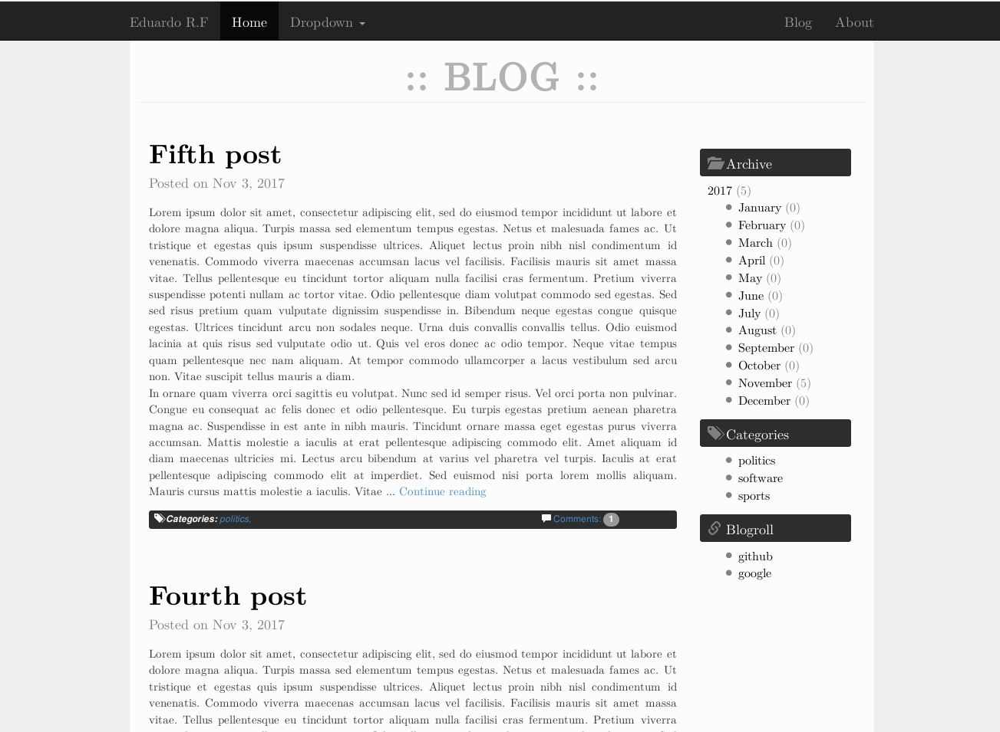

Description 
-----------
An attempt of personal website with a blog app made with Django from scratch. It supports pagination of blog posts, sorting posts by tags and date, comments and blogrolling. An admin interface is provided with a tinyMCE editor embeeded for easy post edition.

>**Note:** The code is far from being complete nor refactored.

Set up
-------
>**Note:** It is recommended to use a virtual environment using *virtualenv* software.
#### Commands
Assuming *virtualenv* is installed, the list of commands to run the site are:

    virtualenv venv_mywebsite
    cd venv_mywebsite
    source bin/activate
    pip install -r mywebsite/requirements.txt
    python manage.py makemigrations blog
    python manage.py migrate
    

#### Dependencies

Dependencies are listed in *requirements.txt* file.

> **Note**: It has only been tested with version 1.10 so there is no guarantee it is forward/backward compatible.

Usage
------
Firstly create an admin user:

    python manage.py createsuperuser

Run the server:

	python manage.py runserver [ip]:[port]

Open the web browser and enter *ip:port/admin* URL (i.e *127.0.0.1:8000/admin*). After login, the contents of the blog can be modified from the admin site. Access the blog by typing *ip:port/blog* as the URL.

 Contact
-------------
For any comment, doubt or issue write to <eduradical951@gmail.com>.

